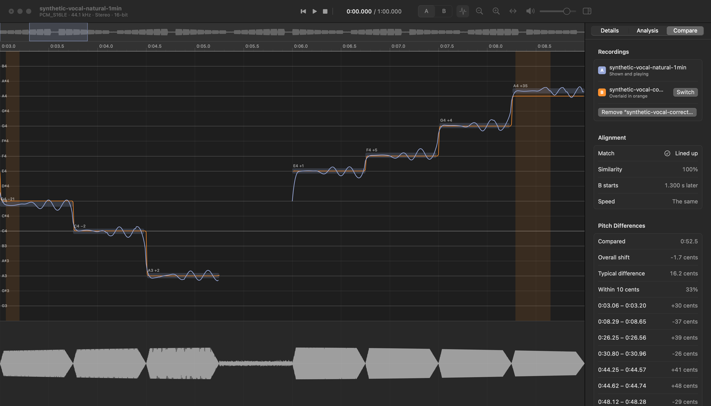

# VocalScope

A desktop app for looking closely at vocal recordings, built to help
investigate whether a vocal has been pitch-corrected. It is a native app on
each platform — SwiftUI on macOS, WinUI on Windows — over one shared core,
and it runs entirely on your own computer: audio is never uploaded.



> **Status: v0.6.0.** VocalScope tracks the pitch of a recording, finds its
> notes, isolates the vocals of a full song, measures four pitch-correction
> indicators, lines two versions of a recording up to compare them, and
> exports all of it.
>
> What it reports are *indicators* and *estimates*. Pitch analysis alone
> cannot prove that a particular tool such as Auto-Tune was used, and
> VocalScope never claims that it can. The thresholds behind the indicators
> are conservative rules of thumb that have so far been checked against
> synthetic test recordings only, not against a body of real, known-corrected
> and known-uncorrected vocals; see [Roadmap](#roadmap).

## Contents

- [Install](#install)
- [Using VocalScope](#using-vocalscope)
- [What the indicators mean](#what-the-indicators-mean)
- [Keyboard shortcuts](#keyboard-shortcuts)
- [macOS and Windows differences](#macos-and-windows-differences)
- [Roadmap](#roadmap)
- [Building from source](#building-from-source)
- [How it is built](#how-it-is-built)
- [Privacy](#privacy)

## Install

Download the latest version from the
[Releases page](https://github.com/j4ckxyz/VocalScope/releases/latest).

Neither build is code-signed yet, so each system asks you to confirm the
first time you open it. That is expected; the steps are below.

### macOS

Requires macOS 14 or later on an Apple silicon Mac (M1 or newer). There is
no Intel build yet.

1. Download **VocalScope-macos-arm64.zip** and double-click it to unzip.
2. Drag **VocalScope** into your **Applications** folder.
3. Double-click it. macOS will say it cannot verify the app; choose **Done**.
4. Open **System Settings › Privacy & Security**, scroll down to the message
   about VocalScope, and choose **Open Anyway**. Confirm once more.

After that it opens normally. If you prefer the Terminal, this does the same
as steps 3–4:

```sh
xattr -dr com.apple.quarantine /Applications/VocalScope.app
```

### Windows

Requires 64-bit Windows 10 (version 1809 or later) or Windows 11. Nothing
else needs installing; the download contains everything it needs.

1. Download **VocalScope-windows-x64.zip**.
2. Right-click it, choose **Extract All…**, and extract it somewhere you will
   keep it, such as your Documents folder.
3. Open the extracted **VocalScope** folder and double-click
   **VocalScope.exe**.
4. If Windows shows “Windows protected your PC”, choose **More info**, then
   **Run anyway**.

To remove VocalScope, delete that folder. Its settings and recent-files list
live in `%LOCALAPPDATA%\VocalScope`.

## Using VocalScope

### 1. Open a recording

When VocalScope starts it shows your recent files and two buttons.

| macOS | Windows |
| --- | --- |
|  |  |

There are several ways to open something:

- Choose **Open Audio…** and pick a file.
- Drag a file from Finder or File Explorer onto the window.
- Pick it from the recent list, or from **File › Open Recent**.
- On macOS, right-click an audio file in Finder and choose
  **Open With › VocalScope**.

VocalScope reads WAV, AIFF, FLAC, MP3, AAC/M4A, ALAC and Ogg Vorbis. Your
original file is only ever read, never changed.

The first time you open a file, VocalScope reads all of it to build the
waveform. That takes about a fifth of a second for a four-minute song and a
few seconds for an hour-long recording, with a progress bar. After that the
same file opens instantly.

### 2. Look around the timeline


The window has four parts:

- **Overview** (the thin strip at the top): the whole recording. When you
  are zoomed in, a highlighted box shows which part you are looking at; drag
  in the overview to move it.
- **Pitch** (the large area), under a time ruler: the pitch curve over a grid
  of note names, with each detected note drawn as a bar and labelled with
  its name and how many cents it is from that note. The coloured vertical
  line is the playhead. Hide the pitch with the toolbar button if you only
  want the waveform.
- **Waveform** (below the pitch).
- **The panel on the right**, with three pages: **Details** (your labels and
  the facts about the file), **Analysis** and **Compare**. Hide or show it
  with the button at the top right.

To move around:

| To do this | macOS | Windows |
| --- | --- | --- |
| Zoom in or out | Pinch on the trackpad, or ⌘ + scroll | Pinch on the touchpad, or Ctrl + scroll |
| Scroll through time | Two-finger swipe, or scroll | Scroll |
| See the whole recording | ⌘0, or double-tap with two fingers | Ctrl+0 |
| Jump to a moment | Click it | Click it |

### 3. Play it

Press **Space** to play or pause. Click anywhere in the waveform to move the
playhead there, or drag to scrub. While playing, the view follows the
playhead; scroll away to look elsewhere and it stops following until the
playhead comes back into view.

### 4. Label the recording

In the details panel you can record what this audio is:

- **Name** — your own name for it. If you leave it blank, the title and
  artist embedded in the file are used, or else the file name.
- **Version** — for example “Original release” or “2011 remaster”.
- **Release year** and **Notes**.
- **This audio is** — a full mix or a vocal stem. VocalScope does not guess.

Below your labels is everything VocalScope read from the file: format,
duration, sample rate, channels, bit depth, bitrate, peak level, and any
embedded tags. If the two channels of a stereo file are identical it says
so, because that file is effectively mono. Anything the file does not state
is shown as “—” rather than guessed.

### 5. Read the pitch

A second or so after a recording opens, its pitch curve appears. Nothing
needs to be started; a four-minute song takes under a second and the result
is remembered. On macOS, moving the pointer over the timeline shows the time,
the note and the frequency under it.

The **Analysis** page lists how long there is a pitch for, how many notes
were found, the range, the median pitch, and the recording's overall tuning
(where its notes cluster relative to A4 = 440 Hz — an old tape transfer can
easily sit 20 cents away, and VocalScope allows for that rather than calling
every note flat).

Pitch tracking follows *one* voice. On a full song the accompaniment gets in
the way, and the Analysis page says so. For a dependable result, isolate the
vocals first.

### 6. Isolate the vocals of a full song

On the **Analysis** page, under **Vocals**, choose a model and then
**Isolate Vocals**. VocalScope suggests the model that suits your computer:

| Model | Download | Best for | Licence |
| --- | --- | --- | --- |
| Kim Vocal 2 | 67 MB | Best quality; 8 GB of memory and six or more cores (it uses about 2.5 GB while running) | Not stated by its publisher |
| UVR-MDX-NET Voc FT | 67 MB | An alternative of the same size | Not stated by its publisher |
| KUIELab MDX-Net B | 30 MB | Older or lower-memory computers; about three times faster | MIT |

No model comes with the app. The first time you use one, VocalScope shows
its size and licence and asks before downloading it; the download is checked
against a known checksum before it is used. This is the only thing VocalScope
ever uses the internet for, and your audio never leaves your computer.

Isolation takes a while — on a fanless 8 GB laptop, about 75 seconds for a
four-minute song with the large model and 25 with the small one — and shows
its progress. You can
cancel it. Afterwards:

- the pitch analysis is redone from the isolated vocals (switch
  **Analyse the isolated vocals** off to go back);
- **Listen to the isolated vocals** plays them instead of the full song,
  from the same place, so you can judge how clean the isolation is;
- **Export…** saves the vocals as a WAV file.

Isolated vocals are kept, so reopening the same file later finds them
straight away. Isolation is good but not perfect: backing vocals, doubled
leads and heavy reverb can remain, and they affect the pitch curve.

### 7. Compare two versions

To compare, say, an original release with a remaster, open one and choose
**Analysis › Add Recording to Compare…** for the other. VocalScope lines the
two up from their loudness — finding how much later one starts and, for tape
or vinyl transfers, any constant difference in speed — and tells you how
well they match. Then:

- the other version's pitch curve is drawn in orange over the one you are
  looking at, and passages where they differ by more than 25 cents are
  shaded;
- **A** and **B** in the toolbar (or the **X** key) switch which version is
  shown and heard, at the matching moment and without stopping playback;
- the **Compare** page gives the offset, the speed difference, the overall
  pitch shift, how often the two agree within 10 cents, and a list of the
  passages that differ; click one to go to it.


This lines up two releases of *one performance*. It does not match two
different performances, and says so when the recordings do not line up.

### 8. Export

**File › Export** writes what VocalScope found:

| Export | Contains |
| --- | --- |
| Report (`.md`) | A plain-language summary: the recording, the pitch facts, the indicators with their explanations, the comparison, and the notes |
| Pitch curve (`.csv`) | One row per 10 ms: time, frequency, note, cents, confidence, level |
| Notes (`.csv`) | One row per note: timing, pitch, cents from the scale, steadiness, vibrato, transition time |
| Notes (`.mid`) | The notes as a MIDI file, timed exactly to the recording |
| Everything (`.json`) | All of the above for other software, with spelled-out field names |
| Isolated vocals (`.wav`) | The vocals as audio |

Every export that includes the indicators includes their caveat.

### 9. Save a project

Labels, notes and which recordings are being compared are kept in a project
file. Choose **File › Save Project** and VocalScope writes a small
`.vocalscope` file. It *refers* to your audio rather than copying it, and
analyses are made again from the audio when needed, so it stays tiny.

If you later move or rename the audio, the project still opens: VocalScope
tells you the file is missing and offers **Locate File…**, and your labels
and notes are untouched. If you move a project folder together with its
audio, it is found automatically.

### Settings (macOS)

**VocalScope › Settings…** (⌘,) has the appearance (light, dark, or match
the system), the default folder for projects, how many recent files to show,
the audio output device, and the volume VocalScope starts with. The Advanced
tab shows diagnostics you can copy into a bug report and opens the log
folder.

The Windows app does not have a settings window yet. It follows your Windows
light or dark mode and plays through the default output device.

## What the indicators mean

The **Analysis** page shows four measurements, each read against what
unprocessed singing usually looks like:

| Indicator | What is measured | Unprocessed singing | Points towards correction |
| --- | --- | --- | --- |
| Closeness to the scale | How far note centres sit from exact semitones, allowing for the recording's overall tuning | Typically 10–25 cents away | Under about 6 cents |
| Steadiness of held notes | Irregular pitch movement within a held note, not counting vibrato or steady drift | Several cents of wander | Under about 3 cents: notes that are almost perfectly flat |
| Vibrato | Whether long notes carry a regular wobble, and its speed and depth | Often present, 4–8 Hz and 20 cents or more deep | Never, alone: plenty of styles are sung without vibrato |
| Movement between notes | How long the pitch takes to get from one joined note to the next | Tens of milliseconds of slide | Under about 18 ms: near-instant jumps |

Each is reported as *typical of unprocessed singing*, *inconclusive*,
*consistent with pitch correction*, or *not enough data*, with the figure
and a sentence on how to read it.

How much weight to put on them:

- They describe the pitch curve. They cannot tell *why* it looks as it does.
  A very accurate singer and light correction can look the same; heavy
  correction can be disguised by later processing; a synthesiser or a
  heavily comped vocal will read as "corrected".
- They are only as good as the pitch curve. On a full mix that has not been
  isolated, or on imperfectly isolated vocals, treat them with suspicion.
- The thresholds are rules of thumb, kept in one place in the source
  (`core/src/analysis/indicators.rs`) so they can be reviewed and revised.
- Comparing two versions of the same performance is much stronger evidence
  than any indicator on one recording: if a held note sags on the 1976
  pressing and is level on the remaster, something changed.

## Keyboard shortcuts

| Action | macOS | Windows |
| --- | --- | --- |
| Open audio | ⌘O | Ctrl+O |
| Open project | ⇧⌘O | Ctrl+Shift+O |
| Save project | ⌘S | Ctrl+S |
| Save project as | ⇧⌘S | Ctrl+Shift+S |
| Close project | ⇧⌘W | Ctrl+W |
| Play / pause | Space | Space |
| Return to start | Return or Home | Home |
| Jump to end | End | End |
| Skip back / forward 5 seconds | ← / → | ← / → |
| Skip back / forward 1 second | ⇧← / ⇧→ | Shift+← / Shift+→ |
| Volume up / down | ↑ / ↓ | — |
| Mute | M | M |
| Zoom in / out | ⌘+ / ⌘− | Ctrl++ / Ctrl+− |
| Zoom to fit | ⌘0 | Ctrl+0 |
| Show or hide details | ⌥⌘I | Ctrl+I |
| Show or hide the pitch | ⌥⌘P | Ctrl+Shift+P |
| Listen to the isolated vocals | ⌥⌘L | Ctrl+L |
| Switch to the other recording | X | X |
| Export a report | ⌘E | Ctrl+E |
| Settings | ⌘, | — |

Single-key shortcuts such as Space are ignored while you are typing in a
text field.

## macOS and Windows differences

Both apps use the same core, so they open the same files, read and write the
same projects, and their timelines behave the same way. The macOS app is
further along:

| | macOS | Windows |
| --- | --- | --- |
| Open, play, seek, zoom, label, projects, recent files | Yes | Yes |
| Pitch curve, notes, indicators | Yes | Yes |
| Vocal isolation, A/B comparison, export | Yes | Yes |
| Settings window | Yes | Not yet |
| Choose audio output device | Yes | Not yet (uses the default) |
| Hover read-out of the time and pitch under the pointer | Yes | Not yet |
| Click a differing passage to go to it | Yes | Yes |
| Tested by hand | Launched and photographed with recordings open; controls not clicked through | Launched and photographed with a recording open, on a build server; controls not clicked through |

That last row matters. All of the analysis lives in the shared core and is
covered by its tests, including one that downloads a real model and isolates
with it. The interfaces are another matter: the macOS app has been launched
and photographed showing an analysis and a comparison, but its buttons,
menus and dialogs have not been clicked through; the Windows app is built,
launched and photographed showing a pitch analysis on a build server for
every change, but nobody has used it on a real PC, and its isolation,
comparison and export screens have never been opened.
Please [report problems](https://github.com/j4ckxyz/VocalScope/issues).

## Roadmap

| Version | Added |
| --- | --- |
| 0.1 | Open, play and display recordings; labels; projects |
| 0.2 | Pitch tracking: the pitch curve, detected notes, deviation in cents |
| 0.3 | Vocal isolation from a full song, with models chosen to suit your hardware |
| 0.4 | Pitch-correction indicators: stability, natural variation, vibrato, transitions |
| 0.5 | A/B comparison of two versions of a recording, aligned in time |
| **0.6** (this one) | Export: JSON, CSV, MIDI and a readable report |

What comes next, roughly in order of how much it matters:

- **Calibrate the indicators on real recordings.** Their thresholds have been
  checked against synthetic "natural" and "corrected" test vocals, which
  shows the measurements work, not that the cut-offs are right for real
  singers and real correction. That needs a set of vocals whose history is
  known.
- Use the Windows app and the macOS app by hand, and fix what that finds.
- Faster isolation using the graphics processor (it runs on the CPU today).
- A settings window and hover read-out on Windows; signed builds.

## Building from source

### macOS

Needs macOS 14 or later, the Xcode Command Line Tools
(`xcode-select --install`) and [Rust](https://rustup.rs) 1.88 or later. Full
Xcode is not needed. The first build downloads ONNX Runtime, which the vocal
isolation runs on, and links it into the app.

```sh
apps/macos/build.sh
open apps/macos/build/VocalScope.app
```

### Windows

Needs [Rust](https://rustup.rs) and the .NET 8 SDK (or Visual Studio 2022
with the “.NET desktop development” workload). In PowerShell, from the
repository folder:

```powershell
cargo build --release -p vocalscope-core
cargo install uniffi-bindgen-cs --git https://github.com/NordSecurity/uniffi-bindgen-cs --tag v0.11.0+v0.31.0
New-Item -ItemType Directory -Force apps/windows/Generated, apps/windows/native
uniffi-bindgen-cs --library target/release/vocalscope_core.dll --no-format -o apps/windows/Generated
Copy-Item target/release/vocalscope_core.dll apps/windows/native/
dotnet publish apps/windows/VocalScope.csproj -c Release -r win-x64 -p:Platform=x64 -o publish/VocalScope
publish/VocalScope/VocalScope.exe
```

These are the same steps the build server runs
([.github/workflows/build.yml](.github/workflows/build.yml)).

### Tests and benchmarks

```sh
cargo test                                # the shared core
cargo test -- --ignored playback_smoke    # plays silently through the real audio device
cargo test -- --ignored isolation_smoke   # downloads a 30 MB model and isolates with it
uv run scripts/make_test_audio.py --long  # synthetic test recordings (not committed)
scripts/bench.sh --save my-change         # macOS: launch time, memory and CPU
scripts/macos-screenshots.sh              # macOS: the pictures in this README
```

The test recordings include a one-minute pair, `synthetic-vocal-natural` and
`synthetic-vocal-corrected`, for trying the indicators and the comparison.
Two small command-line tools help when working on the analysis:

```sh
cargo run --release --example analyse -- song.flac           # pitch summary and indicators
cargo run --release --example isolate_vocals -- song.flac model.onnx kim_vocal_2 vocals.wav
```

## How it is built

One shared core and one native user interface per platform. There is no web
view anywhere.

| Part | Where | Written in |
| --- | --- | --- |
| Core: decoding, playback, waveforms, pitch analysis, vocal isolation, comparison, export, projects, storage, timeline maths | `core/` | Rust |
| macOS app | `apps/macos/` | Swift (SwiftUI and AppKit) |
| Windows app | `apps/windows/` | C# (WinUI 3) |

The apps reach the core through bindings generated from the Rust source by
[UniFFI](https://mozilla.github.io/uniffi-rs/). Anything that is not drawing
or a platform convention lives in the core, so it is written and tested
once. More in [docs/ARCHITECTURE.md](docs/ARCHITECTURE.md); measurements in
[docs/PERFORMANCE.md](docs/PERFORMANCE.md).

## Privacy

Everything is analysed on your own computer. VocalScope makes exactly one
kind of network connection: downloading a vocal-isolation model from GitHub,
when you ask for one and after it has shown you what it is about to fetch.
Your audio, your projects and your results are never sent anywhere. Logs
stay on your computer and never contain audio.

## License

MIT — see [LICENSE](LICENSE). Third-party components keep their own
licenses; notably the Symphonia audio decoders are MPL-2.0 and ONNX Runtime
is MIT. The vocal-isolation models are not part of VocalScope and are not
distributed with it; each is downloaded from its publisher at your request,
and the app shows the licence its publisher states for it, including when
none is stated.
