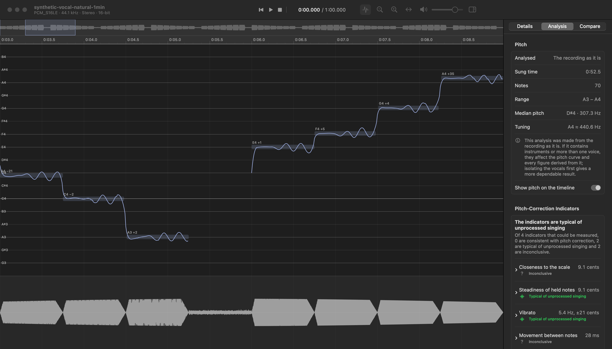
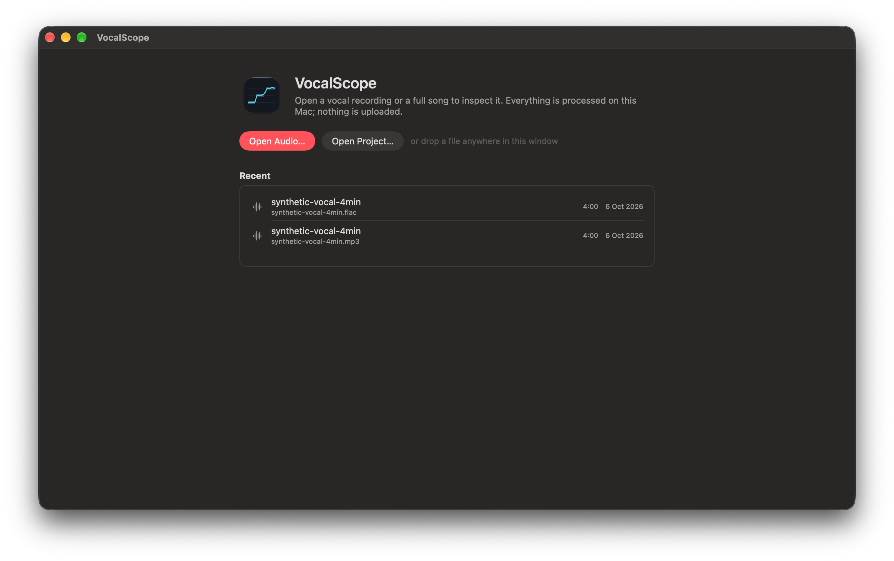
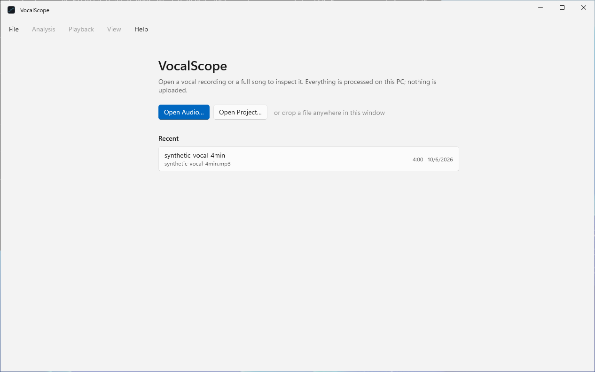
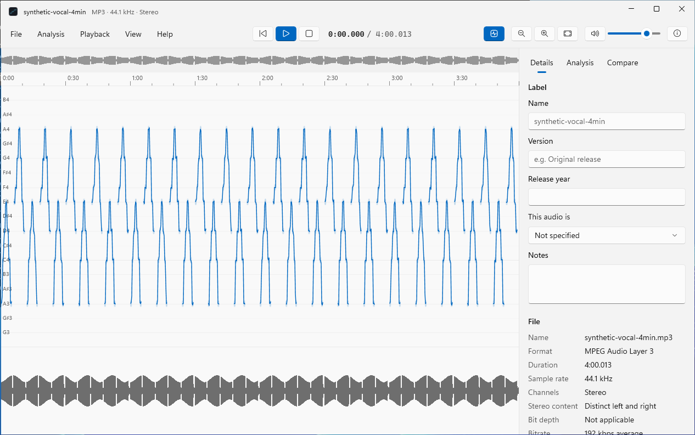

# VocalScope

A desktop app for looking closely at vocal recordings, built to help
investigate whether a vocal has been pitch-corrected. It is a native app on
each platform — SwiftUI on macOS, WinUI on Windows — over one shared core,
and it runs entirely on your own computer: audio is never uploaded.



> **Status: v0.1.0, the foundation.** Today VocalScope opens, plays and
> displays recordings and keeps your notes about them. The analysis itself —
> pitch tracking, vocal isolation, correction indicators, A/B comparison —
> is not built yet; see [Roadmap](#roadmap).
>
> When the analysis arrives it will report *indicators* and *estimates*.
> Pitch analysis alone cannot prove that a particular tool such as Auto-Tune
> was used, and VocalScope will never claim that it can.

## Contents

- [Install](#install)
- [Using VocalScope](#using-vocalscope)
- [Keyboard shortcuts](#keyboard-shortcuts)
- [macOS and Windows differences](#macos-and-windows-differences)
- [Roadmap](#roadmap)
- [Building from source](#building-from-source)
- [How it is built](#how-it-is-built)
- [Privacy](#privacy)

## Install

Download the latest version from the
[Releases page](https://github.com/j4ckxyz/VocalScope/releases/latest).

Neither build is code-signed yet, so each system asks you to confirm the
first time you open it. That is expected; the steps are below.

### macOS

Requires macOS 14 or later on an Apple silicon Mac (M1 or newer). There is
no Intel build yet.

1. Download **VocalScope-macos-arm64.zip** and double-click it to unzip.
2. Drag **VocalScope** into your **Applications** folder.
3. Double-click it. macOS will say it cannot verify the app; choose **Done**.
4. Open **System Settings › Privacy & Security**, scroll down to the message
   about VocalScope, and choose **Open Anyway**. Confirm once more.

After that it opens normally. If you prefer the Terminal, this does the same
as steps 3–4:

```sh
xattr -dr com.apple.quarantine /Applications/VocalScope.app
```

### Windows

Requires 64-bit Windows 10 (version 1809 or later) or Windows 11. Nothing
else needs installing; the download contains everything it needs.

1. Download **VocalScope-windows-x64.zip**.
2. Right-click it, choose **Extract All…**, and extract it somewhere you will
   keep it, such as your Documents folder.
3. Open the extracted **VocalScope** folder and double-click
   **VocalScope.exe**.
4. If Windows shows “Windows protected your PC”, choose **More info**, then
   **Run anyway**.

To remove VocalScope, delete that folder. Its settings and recent-files list
live in `%LOCALAPPDATA%\VocalScope`.

## Using VocalScope

### 1. Open a recording

When VocalScope starts it shows your recent files and two buttons.

| macOS | Windows |
| --- | --- |
|  |  |

There are several ways to open something:

- Choose **Open Audio…** and pick a file.
- Drag a file from Finder or File Explorer onto the window.
- Pick it from the recent list, or from **File › Open Recent**.
- On macOS, right-click an audio file in Finder and choose
  **Open With › VocalScope**.

VocalScope reads WAV, AIFF, FLAC, MP3, AAC/M4A, ALAC and Ogg Vorbis. Your
original file is only ever read, never changed.

The first time you open a file, VocalScope reads all of it to build the
waveform. That takes about a fifth of a second for a four-minute song and a
few seconds for an hour-long recording, with a progress bar. After that the
same file opens instantly.

### 2. Look around the timeline



The window has three parts:

- **Overview** (the thin strip at the top): the whole recording. When you
  are zoomed in, a highlighted box shows which part you are looking at; drag
  in the overview to move it.
- **Waveform** (the large area), with a time ruler above it. The coloured
  vertical line is the playhead.
- **Details** (the panel on the right): your labels for the recording, and
  the facts about the file. Hide or show it with the button at the top
  right.

To move around:

| To do this | macOS | Windows |
| --- | --- | --- |
| Zoom in or out | Pinch on the trackpad, or ⌘ + scroll | Pinch on the touchpad, or Ctrl + scroll |
| Scroll through time | Two-finger swipe, or scroll | Scroll |
| See the whole recording | ⌘0, or double-tap with two fingers | Ctrl+0 |
| Jump to a moment | Click it | Click it |

### 3. Play it

Press **Space** to play or pause. Click anywhere in the waveform to move the
playhead there, or drag to scrub. While playing, the view follows the
playhead; scroll away to look elsewhere and it stops following until the
playhead comes back into view.

### 4. Label the recording

In the details panel you can record what this audio is:

- **Name** — your own name for it. If you leave it blank, the title and
  artist embedded in the file are used, or else the file name.
- **Version** — for example “Original release” or “2011 remaster”.
- **Release year** and **Notes**.
- **This audio is** — a full mix or a vocal stem. VocalScope does not guess.

Below your labels is everything VocalScope read from the file: format,
duration, sample rate, channels, bit depth, bitrate, peak level, and any
embedded tags. If the two channels of a stereo file are identical it says
so, because that file is effectively mono. Anything the file does not state
is shown as “—” rather than guessed.

### 5. Save a project

Labels and notes are kept in a project file. Choose **File › Save Project**
and VocalScope writes a small `.vocalscope` file. It *refers* to your audio
rather than copying it, so it stays tiny.

If you later move or rename the audio, the project still opens: VocalScope
tells you the file is missing and offers **Locate File…**, and your labels
and notes are untouched. If you move a project folder together with its
audio, it is found automatically.

### Settings (macOS)

**VocalScope › Settings…** (⌘,) has the appearance (light, dark, or match
the system), the default folder for projects, how many recent files to show,
the audio output device, and the volume VocalScope starts with. The Advanced
tab shows diagnostics you can copy into a bug report and opens the log
folder.

The Windows app does not have a settings window yet. It follows your Windows
light or dark mode and plays through the default output device.

## Keyboard shortcuts

| Action | macOS | Windows |
| --- | --- | --- |
| Open audio | ⌘O | Ctrl+O |
| Open project | ⇧⌘O | Ctrl+Shift+O |
| Save project | ⌘S | Ctrl+S |
| Save project as | ⇧⌘S | Ctrl+Shift+S |
| Close project | ⇧⌘W | Ctrl+W |
| Play / pause | Space | Space |
| Return to start | Return or Home | Home |
| Jump to end | End | End |
| Skip back / forward 5 seconds | ← / → | ← / → |
| Skip back / forward 1 second | ⇧← / ⇧→ | Shift+← / Shift+→ |
| Volume up / down | ↑ / ↓ | — |
| Mute | M | M |
| Zoom in / out | ⌘+ / ⌘− | Ctrl++ / Ctrl+− |
| Zoom to fit | ⌘0 | Ctrl+0 |
| Show or hide details | ⌥⌘I | Ctrl+I |
| Settings | ⌘, | — |

Single-key shortcuts such as Space are ignored while you are typing in a
text field.

## macOS and Windows differences

Both apps use the same core, so they open the same files, read and write the
same projects, and their timelines behave the same way. The macOS app is
further along:

| | macOS | Windows |
| --- | --- | --- |
| Open, play, seek, zoom, label, projects, recent files | Yes | Yes |
| Settings window | Yes | Not yet |
| Choose audio output device | Yes | Not yet (uses the default) |
| Hover read-out of the time under the pointer | Yes | Not yet |
| Tested by hand | Launch and file-open only | Launch and file-open only, on a build server |

That last row matters: the Windows app is built and launched automatically
on a build server for every change, but nobody has used it on a real PC yet.
The macOS app has only been launched and shown a file; its buttons, menus
and dialogs have not been clicked through. Please
[report problems](https://github.com/j4ckxyz/VocalScope/issues).

## Roadmap

| Version | Adds |
| --- | --- |
| **0.1** (this one) | Open, play and display recordings; labels; projects |
| 0.2 | Pitch tracking: the pitch curve, detected notes, deviation in cents |
| 0.3 | Vocal isolation from a full song, with models chosen to suit your hardware |
| 0.4 | Pitch-correction indicators: stability, natural variation, vibrato, transitions |
| 0.5 | A/B comparison of two versions of a recording, aligned in time |
| 0.6 | Export: JSON, CSV, MIDI and a readable report |

## Building from source

### macOS

Needs macOS 14 or later, the Xcode Command Line Tools
(`xcode-select --install`) and [Rust](https://rustup.rs). Full Xcode is not
needed.

```sh
apps/macos/build.sh
open apps/macos/build/VocalScope.app
```

### Windows

Needs [Rust](https://rustup.rs) and the .NET 8 SDK (or Visual Studio 2022
with the “.NET desktop development” workload). In PowerShell, from the
repository folder:

```powershell
cargo build --release -p vocalscope-core
cargo install uniffi-bindgen-cs --git https://github.com/NordSecurity/uniffi-bindgen-cs --tag v0.11.0+v0.31.0
New-Item -ItemType Directory -Force apps/windows/Generated, apps/windows/native
uniffi-bindgen-cs --library target/release/vocalscope_core.dll --no-format -o apps/windows/Generated
Copy-Item target/release/vocalscope_core.dll apps/windows/native/
dotnet publish apps/windows/VocalScope.csproj -c Release -r win-x64 -p:Platform=x64 -o publish/VocalScope
publish/VocalScope/VocalScope.exe
```

These are the same steps the build server runs
([.github/workflows/build.yml](.github/workflows/build.yml)).

### Tests and benchmarks

```sh
cargo test                                # the shared core
cargo test -- --ignored playback_smoke    # plays silently through the real audio device
uv run scripts/make_test_audio.py --long  # synthetic test recordings (not committed)
scripts/bench.sh --save my-change         # macOS: launch time, memory and CPU
```

## How it is built

One shared core and one native user interface per platform. There is no web
view anywhere.

| Part | Where | Written in |
| --- | --- | --- |
| Core: decoding, playback, waveforms, projects, storage, timeline maths | `core/` | Rust |
| macOS app | `apps/macos/` | Swift (SwiftUI and AppKit) |
| Windows app | `apps/windows/` | C# (WinUI 3) |

The apps reach the core through bindings generated from the Rust source by
[UniFFI](https://mozilla.github.io/uniffi-rs/). Anything that is not drawing
or a platform convention lives in the core, so it is written and tested
once. More in [docs/ARCHITECTURE.md](docs/ARCHITECTURE.md); measurements in
[docs/PERFORMANCE.md](docs/PERFORMANCE.md).

## Privacy

This version makes no network connections at all. Later versions will use
the network only to download analysis models you ask for, and to check for
updates. Logs stay on your computer and never contain audio.

## License

MIT — see [LICENSE](LICENSE). Third-party components keep their own
licenses; notably the Symphonia audio decoders are MPL-2.0.
